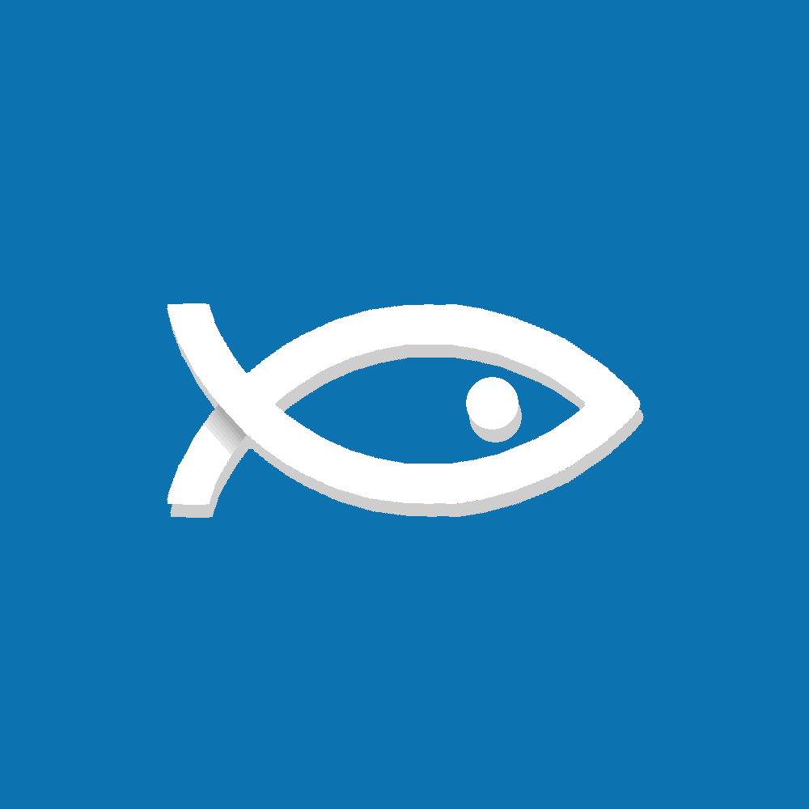

<div align="center">
    
</div>

<br />

# The Cod Compiler
Cod is an opensource concatenative stack-based general purpose programming language. Its transpiled to C and then compiled further to a native executable using external compilers like GCC.

<br />

# Installation
Currently The Cod transpiler is written in python meaning you will
need to have Python 3 installed on your system. You will also need
a C compiler like GCC, Clang or MSVC if you want to compile it further to a native executable.

In the future Cod is planned to be self hosted meaning the transpiler will be in the form of an executable that you can put in your path environment variable.

<br />

# Usage
To compile a .cod script to C, you will need to use the command `python compiler.py path/to/script.cod` where compiler.py is the python script located in `src/compiler.py`.

<br />

# Language
Example code:

```lua
-- Max number to count to
alias max 100

-- Macro to increment top value of stack
macro increment {
  1 +
}

-- Macro to check if we have reached the max
macro check_not_at_max {
  dup 1 - max <
}

-- Macro to print a newline char
macro print_newline {
  10 printc pop
}

-- Starting number
1

-- While not reached max yet 
check_not_at_max while {
  pop
  printn
  increment
  print_newline
  check_not_at_max
}
```

This code will print all numbers from 1 to 100 in a loop. If you want to learn more about the language, you can visit the [language guide](language.md).
